# 云盘系统 Cloud-Storage-Kukdo (CSK)
## 项目简介
Cloud-Storage-Kukdo (CSK) 开源云盘系统：基于Springboot + MySQL + Picocli + Httpclient5进行开发，遵循RESTful风格进行API设计。


本云盘系统旨在为用户提供高效、安全、可靠且可扩展的文件存储服务，
支持本地和阿里云存储两种存储模式，可根据用户需求和业务场景灵活调整存储策略。

主要功能包括存储目录的文件列表展示，以及文件的上传、下载、重命名和删除等。
## 项目部署
### 1. 配置环境变量
修改项目中的`.env`文件内容，将所有所需的信息进行补全，主要包括：
1. 文件存储服务类型：本地`(local)`或者阿里云OSS`(aliyun)`
2. 阿里云OSS访问端口：对应地域节点
3. 阿里云OSS访问ID
4. 阿里云OSS访问密钥
5. 阿里云OSS的Bucket名称
6. Spring的数据库用户名（可使用默认参数）
7. Spring的数据库密码（可使用默认参数）
8. 文件的上传路径（可使用默认参数，在`docker-compose.yml`中可以修改宿主机和镜像目录映射）

> 注意：请将以下配置参数全部填写完毕再启动服务端和客户端
```.env
FILE_SERVICE_TYPE= # local or aliyun
ALIYUN_OSS_ENDPOINT= # your_oss_endpoint
ALIYUN_OSS_ACCESS_KEY_ID= # your_access_key_id
ALIYUN_OSS_ACCESS_KEY_SECRET= # your_access_key_secret
ALIYUN_OSS_BUCKET_NAME= # your_bucket_name
SPRING_DATASOURCE_USERNAME=root
SPRING_DATASOURCE_PASSWORD=password
FILE_UPLOAD_DIR=/app/upload_files
```
### 2. 使用Docker启动服务端
确保在项目的根目录`(cloud-storage-parent)`中有两个文件，分别是`docker-compose.yml`和`Dockerfile`，
在当前根目录唤醒终端并执行命令`docker-compose up --build`即可启动Springboot的服务，其映射的默认端口号是`8080`，
可以看到如下提示表示服务端启动成功：

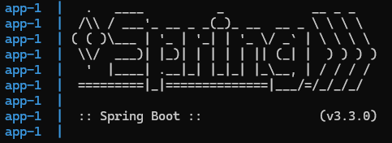

> 注：使用Ctrl+C或者在Docker Desktop中可以停止服务


### 3. 启动客户端
然后，将目录切换到项目根目录的子目录`(cloud-storage-client)`，
接着在终端中输入命令`java -jar ./target/cloud-storage-client-0.3-SNAPSHOT.jar`即可启动客户端，可以看到如下提示表示客户端启动成功：

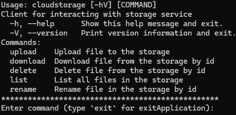
> 注：在终端输入`exit`可退出客户端终止会话
## 功能说明
### 文件上传: `upload`
通过执行命令`upload --name/-n yourFileName.xxx --source/-s C:/.../...`来调用文件上传功能。

参数说明如下：
* `--name, -n`: 指定上传的文件名称
* `--source, -s`: 指定本地的文件上传路径（推荐绝对路径）

### 文件下载: `download`
通过执行命令`download --id XX --name/-n yourDownloadName.xxx --destination/-d C:/.../...`来调用文件下载功能。

参数说明如下：
* `--id`: 指定下载的文件ID
* `--name, -n`: 指定下载的文件名称
* `--destination, -d`: 指定本地的文件下载路径（推荐绝对路径）
> 注意：由于本项目的构建遵循RESTful，所以在请求中不允许出现动词，如若忘记文件的ID可以随时调用list进行查询。

### 文件重命名: `rename`
通过执行命令`rename --id XX --name/-n yourNewName.xxx`来使用文件重命名功能。

参数说明如下：
* `--id`: 指定需要重命名的文件ID
* `--name, -n`: 指定重命名的新文件名

### 文件删除: `delete`
通过执行命令`delete --id XX`来使用文件删除功能。

参数说明如下：
* `--id`: 指定需要删除的文件ID

### 文件列表展示: `list`
列出当前工作目录（阿里云OSS的Bucket或者本地存储路径）中的文件名称和唯一ID

## 功能浏览
### 文件上传测试
1. 阿里云OSS
   
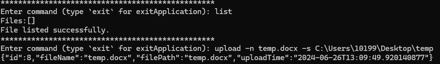


2. 本地存储

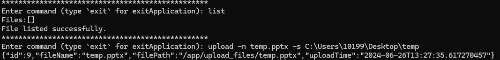
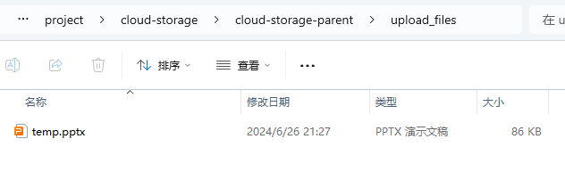

### 文件下载测试
1. 阿里云OSS

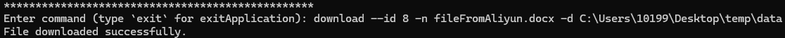
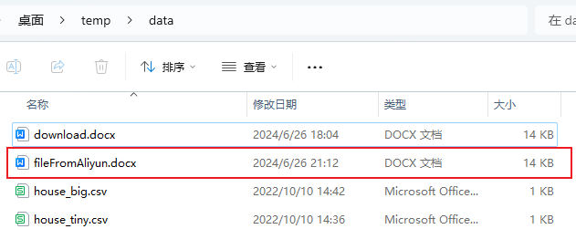

2. 本地存储

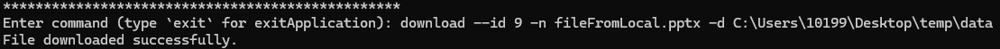
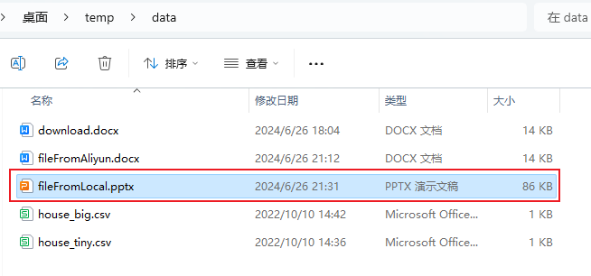

### 文件重命名测试
1. 阿里云OSS

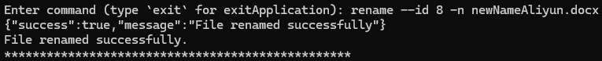


2. 本地存储

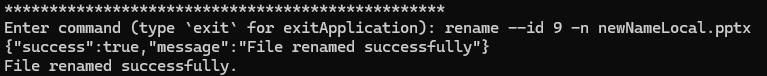
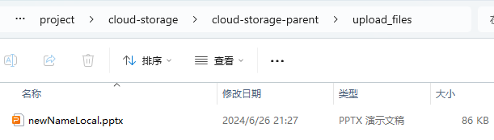

### 文件列表展示测试
1. 阿里云OSS

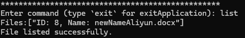

2. 本地存储

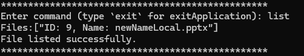

### 文件删除测试
1. 阿里云OSS

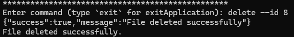


2. 本地存储

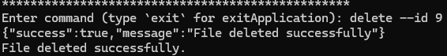
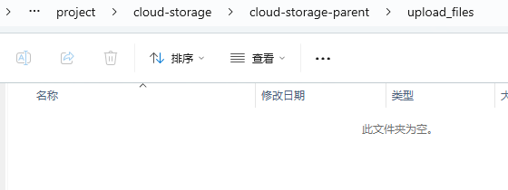

### 总测试流程
1. 阿里云OSS

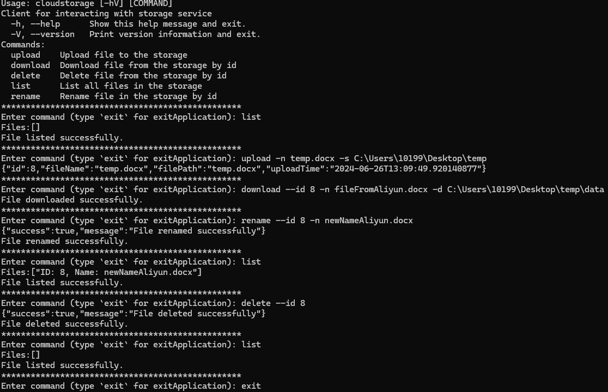

2. 本地存储

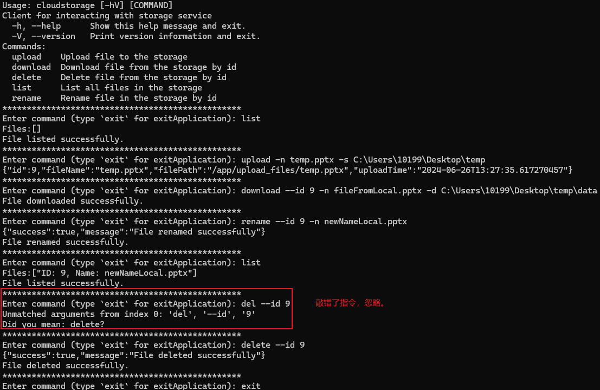

## 项目架构
待补充时序图，泳道图，UML类图等...

## 一些想法
对每个元数据类增加一个标记本地和阿里云的flag...

## Acknowledgment
* 作者：姜志鹏 (Kukdo)
* 版本号：0.3
* 更新时间：2024.06.26
* 实现周期：06.17-06.26
> 致谢：在此特别感谢夏从零Mentor的细心指导和每日答疑
